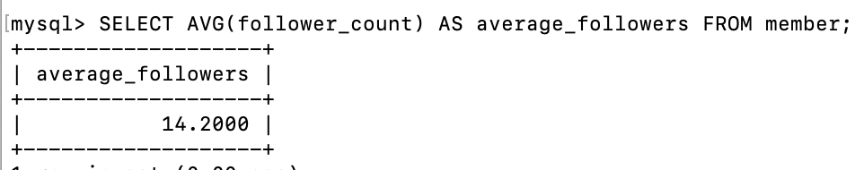

# WeHelp Week5

## SQL CRUD

1.使用 INSERT 指令新增一筆資料到 member 資料表中，這筆資料的 username 和 password 欄位必須是 test。接著繼續新增至少 4 筆隨意的資料。
 2. 使用 SELECT 指令取得所有在 member 資料表中的會員資料。
 3.
使用 SELECT 指令取得所有在 member 資料表中的會員資料，並按照 time 欄位，由近到遠排序。
 4.使用 SELECT 指令取得 member 資料表中第 2 到第 4 筆共三筆資料，並按照 time 欄位，由近到遠排序。( 並非編號 2、3、4 的資料，而是排序後的第 2 ~ 4 筆資料 )
 5.使用 SELECT 指令取得欄位 username 是 test 的會員資料。
 6.使用 SELECT 指令取得欄位 username 是 test、且欄位 password 也是 test 的資料。
 7.使用 UPDATE 指令更新欄位 username 是 test 的會員資料，將資料中的 name 欄位改成 test2。
 

## SQL Aggregate Functions

1.取得 member 資料表中，總共有幾筆資料 ( 幾位會員 )。
 2.取得 member 資料表中，所有會員 follower_count 欄位的總和。
 3.取得 member 資料表中，所有會員 follower_count 欄位的平均數。

## SQL JOIN

1.在資料庫中，建立新資料表紀錄留言資訊，取名字為 message。資料表中必須包含以下欄位設定:  
 2.使用 SELECT 搭配 JOIN 語法，取得所有留言，結果須包含留言者的姓名。
 3.使用 SELECT 搭配 JOIN 語法，取得 member 資料表中欄位 username 是 test 的所有留言，資料中須包含留言者的姓名。
 4.使用 SELECT、SQL Aggregate Functions 搭配 JOIN 語法，取得 member 資料表中欄位 username 是 test 的所有留言平均按讚數。

